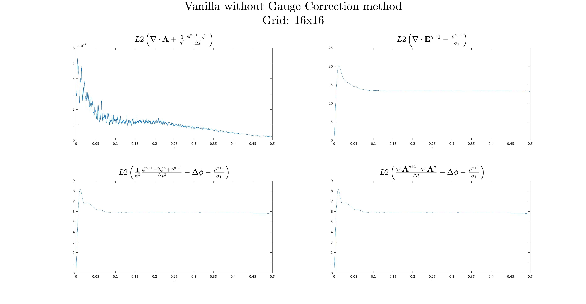

# The State of Things

One of the main draws of MOLT is a theorem proved by Bill Sands that establishes an if and only if relationship the satisfaction of the continuity equation $\frac{\partial \rho}{\partial t} + \nabla \cdot \textbf{J} = 0$ and the satisfaction of the Lorenz Gauge Condition $\frac{1}{\kappa^2}\frac{\partial \phi}{\partial t} + \nabla \cdot \textbf{A} = 0$. This code's primary purpose is exploring this relationship, doing so in three experiments, the moving blob of electrons, the Weibel instability, and the numerical heating test. If one looks at these tests one will see three options in common for the scattering of charge and current density ($\rho$ and $\textbf{J}, respectively), and the solving of the wave equations:

$$
\frac{1}{\kappa^2}\frac{\partial^2 \phi}{\partial t^2} - \Delta \phi = \frac{\rho}{\sigma_1}, \\
\frac{1}{\kappa^2}\frac{\partial^2 \textbf{A}}{\partial t^2} - \Delta \textbf{A} = \sigma_2 \textbf{J}.
$$

The first, called "vanilla," scatters the particle charge and current density in a naive bilinear interpolation, which is standard practice. It then uses the BDF1 solver to compute the next iteration of $\phi$ and $\textbf{A}$. Scattering the charge and current in such a way does not satisfy the continuity equation, and so we can expect an error in the gauge to show up, roughly $\mathcal{O}(10^{-5})$.

The second, called "update method FFT," scatters the current density in a naive bilinear interpolation, but then uses the semi-discretized continuity equation

$$
\rho^{n+1} = \rho^{n} - \Delta t \nabla \cdot \textbf{J},
$$

To compute the charge density, computing the divergence of $\textbf{J}$ using the Fast Fourier Transform (FFT) and thus enforcing the continuity equation. In so doing we satisfy the theorem and can expect machine precision gauge errors, which indeed we get, roughly $\mathcal{O}(10^{-12})$.

The third, called "update method FD6," is almost identical to the second except it uses the sixth order finite difference method (FD6) to compute the divergence. It has similar results.

A fourth method for solving the wave equations is in development for reasons which will be made clear later on. First, we take $\textbf{J}$ and solve for $\textbf{A}$ using standard BDF1. We then consider the first time derivative of the gauge condition

$$
\frac{\partial}{\partial t}\left(\nabla \cdot \textbf{A}\right) + \frac{1}{\kappa^2}\frac{\partial^2\phi}{\partial t^2} = 0.
$$

We semi-discretize

$$
\frac{\nabla\cdot\textbf{A}^{n+1} - \nabla\cdot\textbf{A}^{n}}{\Delta t} + \frac{1}{\kappa^2}\frac{\phi^{n+1} - 2\phi^{n} + \phi^{n-1}}{\Delta t^2} = 0.
$$

We can plug this into the wave equation for $\phi$, resulting in Poisson's equation:

$$
\Delta \phi^{n+1} = \frac{\rho}{\sigma_1} + \frac{\nabla\cdot\textbf{A}^{n+1} - \nabla\cdot\textbf{A}^{n}}{\Delta t}.
$$

We then solve Poisson's equation using the FFT (may explore other methods as well).

# Why the Fourth Method?

The fourth method is pretty convoluted and seemingly throws away a lot of the simplicity that the BDF1 method brings with it. Why are we using it? In addition to linking the continuity equation to the Gauge condition, we have a theorem that shows satisfaction of the Gauge condition implies satisfaction of Gauss' Law, $\nabla \cdot \textbf{E} = 0$. However, numerical experiments are not following this theorem. This is due to machine precision errors creeping in through the multiplication and division of small numbers (ie $\Delta t$).

}

